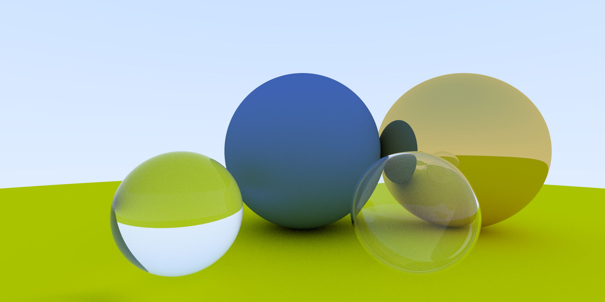

# ray-tracing-in-one-weekend
A CPU-based ray tracer implemented from Peter Shirley's [_Ray Tracing In One Weekend_](https://raytracing.github.io/books/RayTracingInOneWeekend.html)

## Running
`make all` will compile the ray tracer, run it, then convert the produced image to a PNG with ImageMagick and write it to `execs/photo.png`. Image generation took 2.5 minutes on my desktop machine with an Intel Core i7-6800K.

## Dependencies
`sudo apt-get install make imagemagick-6.q16`

Tested on Ubuntu 20.04.1 LTS.